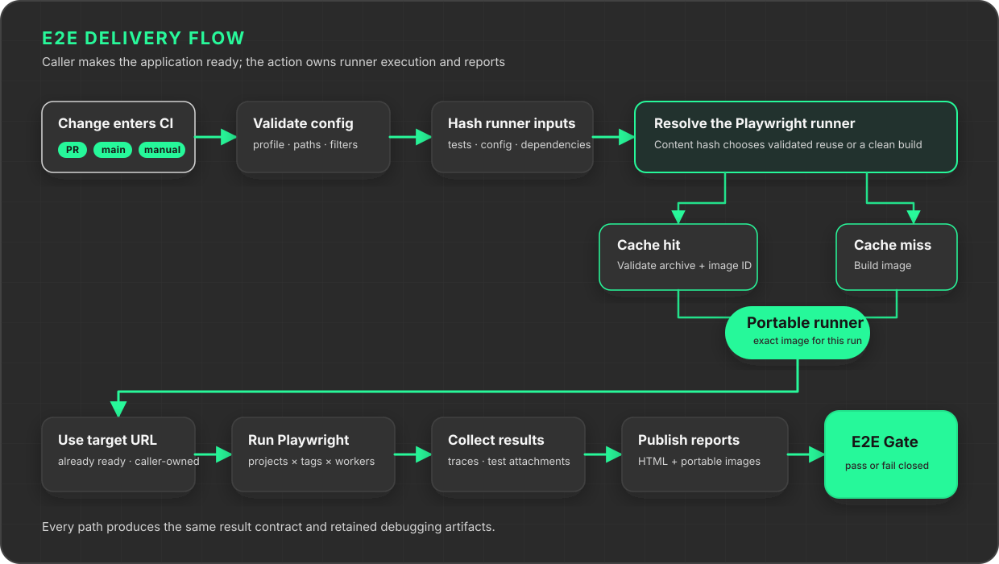
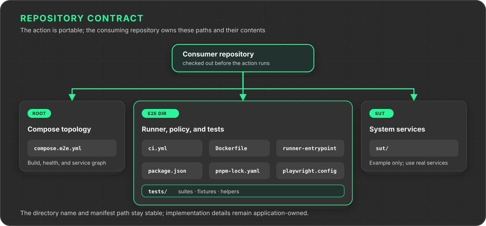

# Playwright E2E

A portable GitHub Action for running Playwright against an already running system under test (SUT).

Your workflow starts the application and passes its base URL. The action owns the test runner, filtering, reports, traces, portable artifacts, and a fail-closed result. It never starts, collects logs from, or stops application services.



## Start from the template

The quickest path is [codotech/playwright-e2e-starter](https://github.com/codotech/playwright-e2e-starter). Create a repository from that template, replace its example SUT and tests, then adapt the profiles in `e2e/ci.yml`.

The template owns repository policy and application lifecycle: triggers, permissions, concurrency, checkout, Compose startup, service logs, cleanup, the sticky pull-request comment, and preservation of the result. This repository owns the portable test execution engine.

## Use the action

Check out the caller repository and make the target ready before invoking the root action. Use a major-version tag that includes the URL-only contract (introduced in `v0.3.0`):

```yaml
permissions:
  contents: read
  pull-requests: write

steps:
  - uses: actions/checkout@v7

  - id: e2e
    uses: codotech/playwright-e2e@v0
    with:
      profile: pull-request
```

Use version tags such as `@v0` or `@v1`, not commit SHAs or feature branches. Verify that the selected release line includes the URL-only contract before adopting this recipe.

### Inputs

| Input | Default | Purpose |
| --- | --- | --- |
| `profile` | `pull-request` | Named execution profile from `e2e/ci.yml` |
| `projects` | empty | Optional Playwright project override, one per line |
| `labels` | empty | Optional Playwright tag override, one per line |
| `label-match` | empty | Optional `all` or `any` tag matching override |
| `runtime-env` | empty | Optional environment variable names to forward to the test container, one per line; never values |

Projects and tags are independent filters. Projects select configured Playwright variants. Tags select tests through Playwright's `--grep`. The action runs the intersection.

### Outputs

| Output | Meaning |
| --- | --- |
| `result` | `passed`, `failed`, or `infrastructure-error` |
| `primary-failure` | Main failure message, empty on success |
| `total`, `passed`, `failed`, `skipped` | Aggregate test counts |
| `profile`, `projects`, `labels`, `label-match` | Effective selection |
| `runner-cache-hit` | Whether a validated runner archive was reused |
| `runner-content-hash` | SHA-256 identity of runner inputs |
| `runner-image-name`, `runner-image-id`, `runner-image-artifact` | Exact portable runner image |
| `results-directory`, `results-artifact` | Merged machine-readable and Playwright results |
| `report-directory` | Generated Playwright HTML report |
| `report-image-name`, `report-image-id`, `report-image-artifact` | Portable image serving the HTML report |

The action fails at the end when tests fail or infrastructure is incomplete. A caller that needs to publish a pull-request comment first can set `continue-on-error: true`, publish the comment from the outputs, and add a final step that fails when the action step outcome is not `success`. The starter demonstrates this pattern.

## Repository contract

The caller keeps these files:



`e2e/ci.yml` is the CI contract:

```yaml
version: 1

runner:
  dockerfile: Dockerfile

playwright:
  config: playwright.config.ts

sut:
  baseUrl: http://127.0.0.1:4173

execution:
  shards: 1
  artifactRetentionDays: 10

profiles:
  pull-request:
    projects: [api, chromium]
    labels: ["@smoke"]
    labelMatch: any

  main:
    projects: [api, chromium]
    labels: []
    labelMatch: all
```

The root action is deliberately a single GitHub job. Playwright can still use multiple workers inside the runner container. Keep `execution.shards: 1`; repository-level job matrices can be added later by the caller without changing the portable engine.

`playwright.config.ts` defines projects, browser/device settings, matching, dependencies, reporters, and runtime behavior. `e2e/ci.yml` selects what CI runs. Unknown keys, invalid paths, unsafe values, nonexistent projects, or malformed tags fail before tests run.

### Target an existing environment

Set `sut.baseUrl` to an already running local service or remote environment:

```yaml
sut:
  baseUrl: https://staging.example.com
```

Keep the other sections of `e2e/ci.yml` unchanged. The action passes this URL as `BASE_URL` to the runner. It does not deploy, reset, or stop the target; the tests themselves may still create or change resources.

The environment must already be ready and reachable from the runner. Connection failures remain test failures. Docker is required for the test runner and report image, not for managing your application. The action does not require Docker Compose.

To run the same suites locally after installing their dependencies:

```bash
BASE_URL=https://staging.example.com pnpm --dir e2e test
```

No Compose commands are needed. Use only environments you are authorized to test. Do not embed credentials in the URL. Workflow environment variables are not forwarded into the runner container unless explicitly listed in `runtime-env`.

### Pass runtime credentials to tests

`runtime-env` requires `v0.4.0` or later. Use a major-version tag such as `@v0` that includes this release; do not substitute a commit SHA or feature branch.

Provide secret values through the action step's `env` and list only variable names in `runtime-env`:

```yaml
- id: e2e
  uses: codotech/playwright-e2e@v0
  env:
    STAGING_API_TOKEN: ${{ secrets.E2E_STAGING_API_KEY }}
  with:
    profile: pull-request
    runtime-env: |
      STAGING_API_TOKEN
```

Tests read `process.env.STAGING_API_TOKEN`. The action passes `--env STAGING_API_TOKEN` to Docker, without placing its value in command arguments, generated files, runner images, or cache identities. Forwarding applies only to the test container, not the build, merge, or report containers. Tests and dependencies can still expose credentials in logs or traces; the caller must protect those artifacts and run only trusted code. Fork pull requests normally cannot access secrets and must not run authenticated suites.

Names must match `[A-Za-z_][A-Za-z0-9_]*`. Blank lines are ignored, surrounding whitespace is trimmed, and duplicate names are forwarded once. Every selected variable must exist and be non-empty. Invalid names, assignments such as `TOKEN=value`, missing values, and reserved names fail as `infrastructure-error` before the test container starts. Validation errors never echo the input or values.

Reserved names are `BASE_URL`, `CI`, `HOME`, `PATH`, `NODE_OPTIONS`, `NODE_PATH`, `BASH_ENV`, and `ENV`. Prefixes `E2E_`, `PLAYWRIGHT_`, `CTRF_`, `GITHUB_`, `RUNNER_`, `INPUT_`, `DOCKER_`, `LD_`, and `DYLD_` are also reserved. Use an application-specific name such as `STAGING_API_TOKEN` instead. Omitting `runtime-env` preserves the default container environment.

### Migrate from action-managed Compose

This is a breaking configuration change. Remove `sut.composeFile`; it is no longer accepted. Move startup and readiness checks before the action in your workflow. Collect service logs, upload them separately, and tear down your application in caller-owned steps with `if: always()`. The [starter](https://github.com/codotech/playwright-e2e-starter) demonstrates the complete Compose recipe.

An existing staging environment needs none of those lifecycle steps. Only its base URL belongs in the action's contract.

## What rebuilds the runner

The runner identity covers every Git-tracked or non-ignored untracked entry below `e2e/`, except `e2e/ci.yml`. Paths, file types, Unix modes, file bytes, and symlink targets all contribute.

A new runner is built when tests, fixtures, dependencies, the lockfile, Playwright configuration, runner entrypoint, Dockerfile, or Docker-ignore rules change. Profiles, filters, retention, base URL, and service-only changes reuse the same runner bytes while still running the suite against the supplied target.

On an exact cache hit, the action validates the archive metadata, image reference, content hash, byte size, SHA-256, and image ID before using it. A missing, evicted, or invalid cache causes a clean rebuild.

## Test lifecycle

The action performs one fail-closed sequence:

1. Validate configuration and resolve the requested profile.
2. Reuse or build the content-addressed Playwright runner.
3. Run the selected Playwright projects and tags against `sut.baseUrl`.
4. Capture test results, traces, screenshots, and attachments.
5. Build the HTML report and portable report image.
6. Upload artifacts and enforce the final result.

A Playwright failure remains the primary failure if later report handling also fails. Missing results, runner identity problems, or publication failures produce `infrastructure-error`; they never turn a run green. Your workflow must separately enforce application startup and cleanup failures.

## Artifacts

| Artifact | Contents |
| --- | --- |
| `e2e-results` | Final JSON result, CTRF report, Playwright HTML report, and test attachments |
| `e2e-runner-image` | Compressed Docker archive for the exact runner used by the run |
| `e2e-report-image` | Compressed Docker archive serving the HTML report on port 8080 |

Download and load a report image:

```bash
docker load --input e2e-report-image/playwright-e2e-report.tar.zst
docker run --rm -p 8080:8080 "$REPORT_IMAGE_NAME"
```

Open `http://127.0.0.1:8080`. Traces and other Playwright attachments are retained inside the report when a test creates them.

The images are workflow artifacts, not registry publications. Artifact retention applies and local image names are not remotely pullable.

## Run this example locally

This repository's sample uses caller-managed Compose. Prerequisites: Docker with Compose, Node.js 22, Corepack, and pnpm 10.26.2.

```bash
corepack enable
corepack prepare pnpm@10.26.2 --activate
pnpm --dir e2e install --frozen-lockfile
pnpm --dir e2e install:browsers
docker compose -f compose.e2e.yml up --detach --build --wait
BASE_URL=http://127.0.0.1:4173 pnpm --dir e2e test
docker compose -f compose.e2e.yml down --volumes --remove-orphans
```

Always run the final cleanup command, including after a failed test. Run `pnpm --dir e2e test:static` for the TypeScript check.

## Platform support

- GitHub.com hosted or self-hosted Linux runners with Docker
- GitHub Actions runner 2.336.0 or newer, required for repository-relative `$/` action references
- One checked-out application repository per job

No inherited secrets are required by the action. The SUT may use repository or environment secrets supplied by its own workflow.

## Test action lifecycle changes

With Node.js 22 and Ruby installed, run the offline regression checks:

```bash
node --test .github/tests/*.test.mjs
```

These check the URL-only contract, rejection of removed Compose configuration, failure propagation, and URL and path validation without contacting a remote environment.

## License

[MIT](LICENSE)
